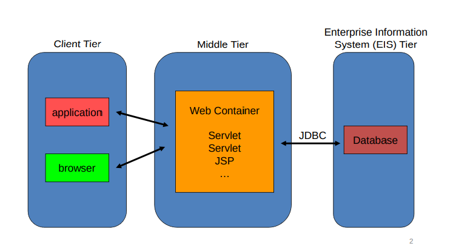

## Esercizio ContaCaratteri ( esame 22-11-2018 )

**Codice di riferimento per la spiegazione: tutorato 2019-20.**

In Java si utilizza `charAt ( int i )` per ottenere un carattere dalla stringa in questione.

Utilizzo la classe `ServerSocket`. 
Utilizziamo due socket, il metodo `accept()` ci fornisce la seconda socket su cui effettuiamo la connessione.

```java
int serverPort = 3333;
ServerSocket serverSocket = new ServerSocket(serverPort);
```

```java
Socket clientSocket = serverSocket.accept();
System.out.println(x: "> Connection received");
printSocketInfo(clientSocket); //Funzione definita nel codice per ritornare info
```

```java
public static void printSocketInfo(Socket socket){
System.out.println("Local Address:" + socket.getLocalAddress());
// Altre funzioni qui.
}
```

Con `getInputStream()` restituisce uno stream di byte, quindi lo passiamo a `InputStreamReader()` per ottenere uno stream di caratteri.

```java
InputStreamReader isr = new InputStreamReader( clientSocket.getInputStream() );
// disaccoppia la parte di inserimento dati con quella di lettura.
BufferedReader in = new BufferedReader(isr);
```

In questo caso la basta una sola `readLine()` anziché un ciclo di `read` come abbiamo visto in C perché il carattere di fine riga viene inoltrato sullo stream solo a chiusura della richiesta.

Per utilizzare la `println`() per inoltrare sulla socket abbiamo bisogno di oggetto `PrintWriter`, usato secondo modalità simili a quelle della `read()`.

```java
OutputStreamWriter ows = new OutputStreamWriter(clientSocket.getOutputStream());
// secondo paremetro per flush automatico del buffer.
PrintWriter out = new PrintWriter(osw, autoFlush:true); 

// ...

out.println(response);
```

## Note su `inparsrvr.c`

È una versione multi-processo / parallela dell'esercizio precedente. Vedi `inparsrvr.c` per l'intero codice.

```c
/* inparsrvr.c */

while ( 1 )
{
	printf("sono %d, accetto connessioni\n", getpid() );
    connect_socket = accept(
        	server_socket, 						// La socket del server.
        	(struct sockaddr *) & client_addr,	// La socket dove inserire i dati del client.
	    	&client_addr_len					// Dim. della socket client.
    	);
	if ( connect_socket == -1)
    {
			perror("accepting");
			close(server_socket);
			exit(-1);
	}
    
	printf("sono %d, pronto al fork del processo servente\n", getpid());
    
    // Eseguo una fork(). Routine del child.
	if (fork() == 0)
    {
		printf("sono %d, pronto a servire\n", getpid());
		printf("\nClient@%s connects on socket/port %d/%u; sends:\n",
		       inet_ntoa(client_addr.sin_addr),
		       connect_socket, (client_addr.sin_port)
        );

		// Ciclo di read per accettare connessioni.
        // Lascia l'ultimo byte di buffer[] libero per un eventuale ASCII 0, che
        // rende buffer una stringa
		while ((retcode = read(connect_socket, buffer, MAXBUF - 1)) > 0)	
        {  
			buffer[retcode] = '\0';
			printf("%s\n...serving...\n", buffer);
            // Esegue servizio operando su buffer[], che invia al cliente collegato.
			doserv();
            
            // Ciclo di write per inoltrare i dati.
			if ((nw = write(connect_socket, buffer,strlen(buffer)+1)) < 0)
            {
				perror("replying to client");
			}
			printf("scritti %d B (ultimi 2 sono CR e LF)\n", nw);
		}
        
        // Ritorno 0 o -1 in caso di errori.
		if (retcode == 0 || errno == EPIPE){
			printf("Client closed connection on socket %d\n", connect_socket);
        }
		else {	// retcode == -1 && (errno != EPIPE)
			perror(">>reading from connection");
        }
		printf("sono %d, finito servizio\n", getpid());
        
        // Il child termina.
		exit(0);
	}
	else
    {
      // Il padre riprende ad ascoltare su accept() dopo aver chiuso la socket
      // NB: essendo nato dalla fork() il child ha uno spazio distinto
      // copia di quello del padre.  
		close(connect_socket);
    }
// end while(1)
}
```

**Esercizio: sostituire la `fork()` con una struttura a thread.**

## Servlet Java

[Slide di riferimento pt.1](http://www.ce.uniroma2.it/~lopresti/Didattica/RetiWeb/RetiWeb1314/Microsoft%20PowerPoint%20-%20Servlet.pdf)
[Slide di riferimento pt.2](http://www.ce.uniroma2.it/~lopresti/Didattica/RetiWeb/RetiWeb1314/Microsoft%20PowerPoint%20-%20Servlet2.pdf)

Le servlet si trovano nel **middle tier**, all'interno del **web container**. Per eseguire codice Java il client ha bisogno di un application engine apposito (**servlet engine** in questo caso). Si può poi utilizzare il **JSP**, un HTML esteso, più ricco, per generare HTML dinamico.



**JDBC** è la libreria Java attraverso cui si possono fare query SQL al database.

La `Servlet` è una classe Java che impementa l'interfaccia `Servlet`.
Un serverlet container può ospitare più servlet.

Quando una servlet viene invocata, l'engine genere un thread Java che inizializza l'oggetto Servelt, persistente fino a distruzione esplicita e il codice scaricato.

Alla prima esecuzione del codice della Servlet ci sarà un leggero ritardo per il caricamento. 

```java
// Implementazione generica di una classe Servlet.
public class MyServlet extends HttpSevlet {
	public void int(){
	// Inizializzo la servlet
	}

    public void service(){
    // Fornisco il servizio
    }

    public void destroy(){
    // Rilascio le risorse
    }
}
```

Definiamo il codice di `service()` ma non ci dobbiamo preoccupare di attivarlo. Verrà triggerato in automatico all'arrivo di nuove richiede.

Quando parliamo delle servlet ci troviamo davanti ad un tipo di programmazione detta **event-driven**.

Citiamo due metodi importanti:

- `doGet()`

- `doPost()`

per rispondere automaticamente alle richieste `GET` e `POST`

```java
response.setContentType("text/html"); 	// Setto il Content-Type.
```