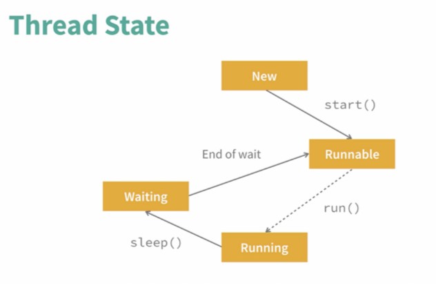
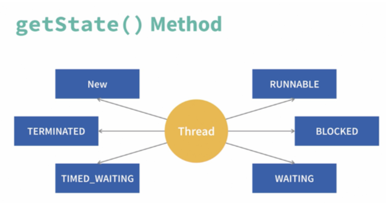

## Thread in Java

```java
// package edu.unict.tswd.thread.hellothread
// hello.java
public class hello {
    public static void main(String[] args) throws InterruptedException {

        // Main is a deamon thread, created by JVM
        Thread tMain = Thread.currentThread();
        System.out.println("Main Thread "+tMain.toString());

        // Let's create a new thread with method 1 (extending Thread class)
        myThread t = new myThread();

        // Start thread. Fa partire il metodo run() di myThread()
        t.start();

        // In "parallel" here
        for (int i = 0; i < 10; i++) {
            System.out.println("<");
        }

        System.out.println("");
        System.out.println("This is the end");
    }
}
```

In Java abbiamo due tipi di thread:

- **thread utente**
  - hanno priorità maggiore (**high priority**)
  - tipicamente sono implementati per adempiere ad un task specifico
- **thread daemon**
  - creati dalla JVM
  - bassa priorità (**low priority**)
  - eseguono task di maintenance (vedi il Garbabe Collector)

Una differenza importante tra i due: la JVM non termina i processi utente finché l'ultimo dei suoi thread non ha finito, mentre per quanto riguarda i thread daemon sono terminati quasi subito.

In Java tutto è un oggetto, persino un thread. È o un istanza di `java.lang.Thread` o di una sua sottoclasse.

Il comportamento è gestito da un'altra classe, di tipo **abstract**, la `java.lang.Runnable()`, dove il metodo `run()` deve essere implementato.

I due metodi di implementazione hanno sia pro che contro.
Con la classe `Thread` ho il difetto di non poter ereditare da altre classi ad esempio.

### Quale tipo di implementazione scegliere?

Estendere la classe `Thread` è più diretto e l'approccio è di tipo **tight coupling**.
Implementare `Runnable` richiede uno step in più ma poi possiamo estendere ed avere **ereditarietà multipla**.

## La classe `Thread`

Attributi di `Thread`:

- `id`
- `name`
- `priority`
- `stage` (5 stati di esecuzione)

Metodi fondamentali di `Thread`:

- `start()`
- `sleep()`
- `join()`
- `interrupt()`

## Note su `Hello2.java`

```java
public class hello2 {
    public static void main(String[] args) throws InterruptedException {
        // Main is a deamon
        Thread tMain = Thread.currentThread();
        System.out.println("Main Thread "+tMain.toString());
        myThread2 t = new myThread2();
        // Start thread
        t.start();
        
        // Create another thread, questa volta implementando Runnable
        myRunnable myRunnable = new myRunnable();
        
        // passo l'instanza della classe che ha implementato il Runnable
        Thread myRunnableThread = new Thread(myRunnable);
        
        // Start
        myRunnableThread.start();

        // In parallel here
        for (int i = 0; i < 10; i++) {
            System.out.println("<");
        }

        System.out.println("");
        System.out.println("This is the end");
    }
}
```

```java
// myRunnable, implementa Runnable
public class myRunnable implements Runnable {
    @Override //sto facendo override di un metodo, indico per pulizia

    public void run() { //notare il metodo
        // Starting
        System.out.println("In run di myRunnable");
        Thread t = Thread.currentThread();
        System.out.println("myRunnable running pid "+t.toString());
        System.out.println(t.getName());
        for (int i = 0; i < 10; i++) {
                System.out.println("\t_");
        }
    }
}
```


## Thread life cycle



**NB: `sleep()` è un metodo bloccante. Il tempo è indicato in milli secondi (o nano secondi)**

## Note su `hello3.java`

```java
public class hello3 {
    public static void main(String[] args) throws InterruptedException {
        // Main is a deamon
        Thread tMain = Thread.currentThread();
        System.out.println("Main Thread "+tMain.toString());
        myThread3 t = new myThread3();
        // Start thread
        t.start();
        // Create another thread
        myRunnable3 myRunnable = new myRunnable3();
        Thread myRunnableThread = new Thread(myRunnable);
        // Start
        myRunnableThread.start();

        // In parallel here
        for (int i = 0; i < 5000; i++) {
            System.out.print("<");
            sleep(1); // addormento il thread. Cosa succede?
            //sleep(new Random().nextInt(5)); // Poor Ascii ART
        }
        System.out.println("This is the end");
    }
}
```

Vedi codice per intero: lo `sleep()` ha una gestione di interruzione specifica perché **il segnale di interruzione ad un thread dormiente va gestita in maniera apposita**.

## Interrupt

Tre metodi utili:

- `interrupt()`: si esegue dentro il thread, se invocato durante un blocco causa un'eccezione
- `isInterrupted()`: se il thread è stato interrotto
-  `interrupted()`: (static)

## Join

Permette di attendere la fine di un thread. Bloccante. Se il thread chiamante viene interrotto genera' un eccezione.

```java
join();
```

## Altri metodi

- `getId()`
- `getName()`
- `getPriority() (1-10)`
- `setPriority()`
- `getState()`: restituisce lo stato del thread
- `isAlive()`

## `getState()`



## Metodi `syncronize`

Applicabile sia ad un singolo metodo che ad un blocco di codice `syncronize` serve per gestire l'esecuzione con i semafori. Metodi di tipo syncronize non possono essere in esecuzione simultaneamente

Metodi:

- `wait()`: blocca il thread, in attesa di `notify()`
- `notify()`: sveglia un singolo thread
- `notifyAll()`: sveglia tutti i thread

## Note sul problema produttore-consumatore

Vedi anche:

- [almost consistance](https://en.wikipedia.org/wiki/Eventual_consistency) dei database noSQL
- esempio multithread su socket / tcp / echoservermt

#### Note sulle prove in itinere

3 prove in itinere, argomenti divisi in blocchi.

**Blocco 1**

- Socket
- Thread

**Blocco 2**

- Tomcat
- Servlet
- Spring Boot

**Blocco 3** (ancora da definire)